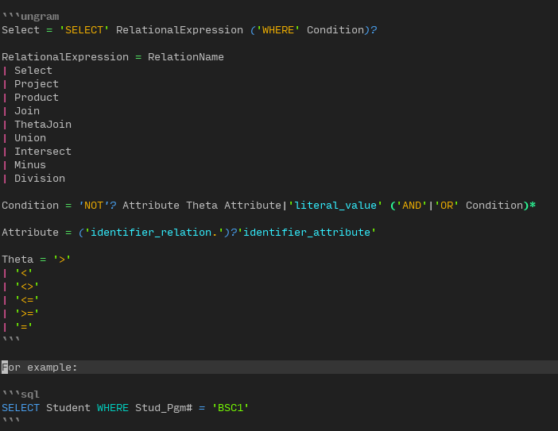

# vim-ungrammar

`Vim-ungrammar` is a plugin for Neovim and Vim for the [Ungrammar][ungrammar] filetype which provides:

* [Filetype](./ftdetect/ungram.vim) detection.
* [`ftplugin`](./ftplugin/ungrammar.vim) setting adjustments.
	* Use `let g:ungrammar_formatting = v:false` to turn it off.
* [Syntax](./syntax/ungrammar.vim) files.

## Preview

Here is a preview of the syntax highlighting, using [nvim-highlite](https://github.com/Iron-E/nvim-highlite) as a theme:



## Configuration

### Highlighting Groups

This plugin defines the following syntax groups:

| Group Name                | Description                      | Example            |
|:--------------------------|:---------------------------------|:-------------------|
| `ungramAlternation`       | An alternation on a rule.        | `\|`               |
| `ungramConditionalGroup`  | A group which is a conditional.  | `(Foo\|Bar)?`      |
| `ungramConditionalString` | A conditional `ungramString`.    | `'for'?`           |
| `ungramConditional`       | A conditional (1-or-0).          | `?`                |
| `ungramLabel`             | A label for a token or string.   | `scope:'local'`    |
| `ungramOperator`          | An operator.                     | `=`                |
| `ungramOr`                | Alternative for a given position.| `Foo\|Bar`         |
| `ungramQuote`             | A quote for a string or token.   | `'`                |
| `ungramRepeatGroup`       | A group which is repeated.       | `(Foo\|Bar)*`      |
| `ungramRepeatString`      | A repeated `ungramString`.       | `'for'*`           |
| `ungramRepeat`            | 0 or more repetitions.           | `*`                |
| `ungramRule`              | A rule for a grammar.            | `Foo`              |
| `ungramString`            | A specific string of characters. | `'for'`            |
| `ungramToken`             | A token.                         | `'identifier_var'` |

### Markdown Integration

You can use this plugin seamlessly with [plasticboy/vim-markdown][plasticboy_markdown] provided that the following is part of your `init.vim` configuration:

```vim
let g:vim_markdown_fenced_languages = ['ungram=ungrammar']
```

Then, you can create codeblocks in markdown and it will use the syntax file from this plugin:

````markdown
	```ungram
	 Foo = 'A' | 'B'
````

## Credits

* [Learn Vimscript The Hard Way](https://learnvimscriptthehardway.stevelosh.com/chapters/45.html) got me started.
* [plasticboy][plasticboy_markdown] wrote a fantastic markdown plugin with syntax highlighting for fenced code blocks.
* [rust-analyzer/ungrammar][ungrammar] created the syntax and initial implementation.
* [tbastos/vim-lua](https://github.com/tbastos/vim-lua) open sourced a clear example of syntax files.

[ungrammar]:https://rust-analyzer.github.io/blog/2020/10/24/introducing-ungrammar.html "Introducing Ungrammar"
[plasticboy_markdown]:https://github.com/plasticboy/vim-markdown "plasticboy/vim-markdown"
